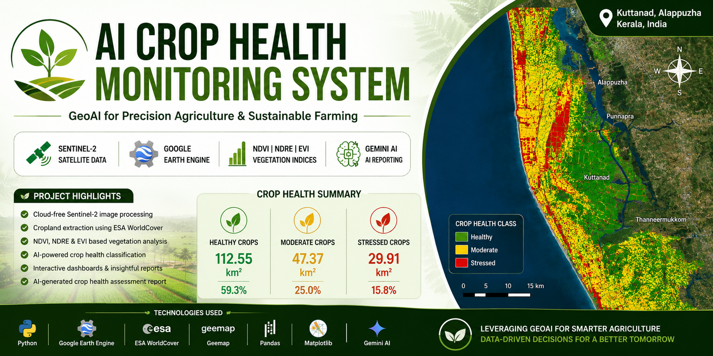
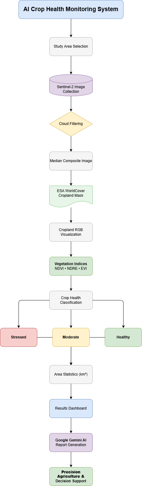
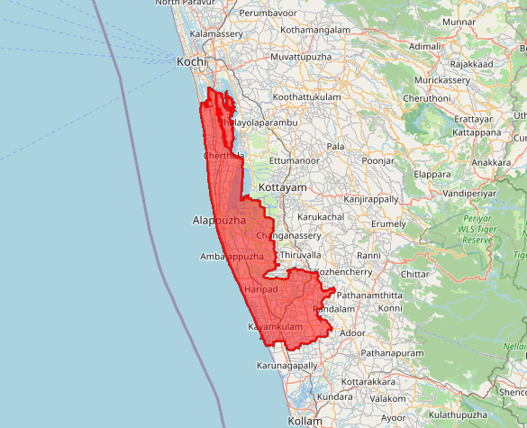
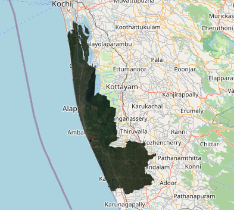
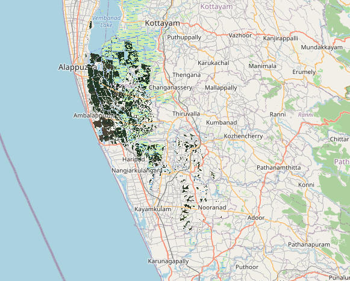
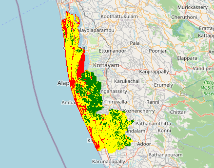
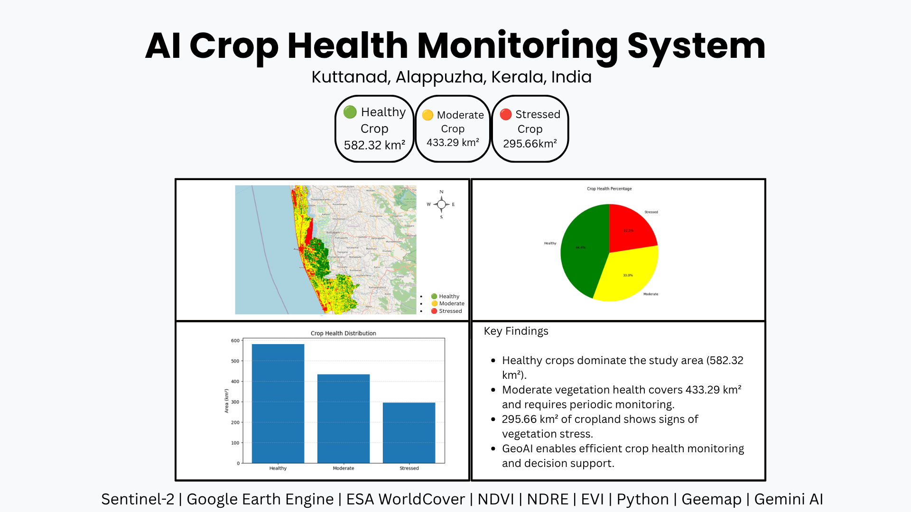

# AI Crop Health Monitoring System

AI-powered crop health monitoring system using **Sentinel-2**, **Google Earth Engine**, **ESA WorldCover**, **NDVI**, **NDRE**, **EVI**, and **Google Gemini AI** for precision agriculture, vegetation health assessment, and automated crop health reporting.



---

# Project Highlights

- Crop health monitoring using Sentinel-2 satellite imagery
- Cloud filtering and image preprocessing
- Cropland extraction using ESA WorldCover
- Vegetation health assessment using NDVI, NDRE, and EVI
- Crop health classification (Healthy, Moderate, Stressed)
- Crop health statistics and dashboard generation
- AI-generated crop health assessment report using Google Gemini AI
- End-to-end GeoAI workflow using Google Earth Engine

---

# Project Overview

Agricultural productivity depends on continuous monitoring of crop conditions throughout the growing season. Traditional field surveys are often time-consuming, expensive, and difficult to scale over large agricultural regions. Satellite remote sensing combined with artificial intelligence provides an efficient alternative for large-scale crop monitoring.

This project presents an **AI-powered Crop Health Monitoring System** developed using **Sentinel-2 satellite imagery**, **Google Earth Engine (GEE)**, **ESA WorldCover**, and **Google Gemini AI** to assess crop health in **Kuttanad, Alappuzha, Kerala, India**.

The workflow integrates cloud-filtered Sentinel-2 imagery with cropland masking to isolate agricultural land before calculating three vegetation indices:

- **NDVI (Normalized Difference Vegetation Index)** – evaluates vegetation vigor.
- **NDRE (Normalized Difference Red Edge Index)** – detects crop stress and chlorophyll variation.
- **EVI (Enhanced Vegetation Index)** – improves vegetation monitoring in dense crop canopies.

Using these indices, agricultural land is classified into **Healthy**, **Moderate**, and **Stressed** crop health categories. The workflow calculates crop health statistics, generates interactive GIS maps, produces analytical dashboards, and automatically creates a professional crop health assessment report using **Google Gemini AI**.

This project demonstrates how GeoAI can support **precision agriculture**, **crop monitoring**, **sustainable farming**, and **data-driven agricultural decision-making**.

---

# Study Area

**Location:** Kuttanad, Alappuzha, Kerala, India

**Study Year:** 2024

---

# Workflow



### Workflow

```text
Study Area Selection
        │
        ▼
Sentinel-2 Data Collection
        │
        ▼
Cloud Filtering
        │
        ▼
Median Composite
        │
        ▼
ESA WorldCover Cropland Mask
        │
        ▼
Cropland RGB Visualization
        │
        ▼
NDVI Calculation
        │
        ▼
NDRE Calculation
        │
        ▼
EVI Calculation
        │
        ▼
Crop Health Classification
        │
        ▼
Crop Health Area Statistics
        │
        ▼
Results Dashboard
        │
        ▼
Google Gemini AI Report Generation
        │
        ▼
Final Crop Health Assessment
```

---

# Technologies Used

- Python
- Google Earth Engine
- Google Colab
- Sentinel-2 Satellite Imagery
- ESA WorldCover
- Geemap
- Pandas
- NumPy
- Matplotlib
- Google Gemini AI
- Remote Sensing
- GeoAI

---

# Methodology

The project follows the workflow below:

1. Select the study area (Kuttanad, Kerala).
2. Acquire Sentinel-2 satellite imagery.
3. Apply cloud filtering and generate a median composite.
4. Extract agricultural land using ESA WorldCover.
5. Calculate NDVI, NDRE, and EVI vegetation indices.
6. Classify crop health into Healthy, Moderate, and Stressed categories.
7. Calculate crop health area statistics.
8. Generate crop health maps and dashboards.
9. Create an AI-powered crop health assessment report using Google Gemini AI.

---

# Results

| Metric | Value |
|---------|--------|
| Healthy Crop Area | **582.32 km²** |
| Moderate Crop Area | **433.29 km²** |
| Stressed Crop Area | **295.66 km²** |

---

# Key Findings

- **Healthy vegetation is the predominant crop condition, covering 582.32 km² of agricultural land.**
- **Moderately healthy crops occupy 433.29 km², indicating areas that should be monitored to maintain productivity.**
- **Approximately 295.66 km² of cropland has been identified as stressed vegetation, highlighting regions that may benefit from targeted agricultural interventions.**
- **The GeoAI workflow enables efficient, scalable, and data-driven crop health assessment for precision agriculture.**

---

# Key Features

- Cloud-filtered Sentinel-2 image processing
- ESA WorldCover cropland masking
- NDVI, NDRE, and EVI analysis
- Crop health classification
- Area statistics calculation
- Interactive GIS visualization
- Results dashboard generation
- AI-generated agricultural assessment reports

---

# Repository Structure

```text
AI-Crop-Health-Monitoring-System/
│
├── README.md
├── LICENSE
├── requirements.txt
├── .gitignore
│
├── notebook/
│   └── AI_Crop_Health_Monitoring_System.ipynb
│
├── images/
│   ├── project_banner.png
│   ├── workflow_diagram.png
│   ├── study_area_map.png
│   ├── true_color_composite.png
│   ├── cropland_mask.png
│   ├── crop_health_map.png
│   ├── bar_chart.png
│   ├── pie_chart.png
│   └── crop_health_dashboard.png
│
├── outputs/
│   ├── Crop_Health_Assessment_Report.txt
│   ├── Crop_Health_Statistics.csv
│   └── kpi_dashboard.png
│
└── docs/
```

---

# Project Outputs

## Study Area



---

## True Color Composite



---

## Cropland Mask



---

## Crop Health Map



---

## Crop Health Dashboard



---

## AI-generated Crop Health Assessment Report

A sample AI-generated report is available below:

[Crop_Health_Assessment_Report.txt](outputs/Crop_Health_Assessment_Report.txt)

---

# Applications

- Precision Agriculture
- Crop Monitoring
- Agricultural Decision Support
- Sustainable Farming
- Smart Agriculture
- Government Planning
- Food Security Studies
- GeoAI Research

---

# Future Improvements

- Multi-temporal crop monitoring
- Seasonal crop health comparison
- Crop yield prediction using Machine Learning
- Soil moisture integration
- Weather data integration
- Drone imagery support
- Streamlit web application
- Automated PDF report generation
- Deep Learning-based crop disease detection

---

# Author

**Vishnu Venu**

GIS Analyst | GeoAI Engineer | Remote Sensing | Spatial Data Science | Python | Google Earth Engine | Generative AI

**LinkedIn**

https://www.linkedin.com/in/vishnu-venu-gis/

---

# 📜 License

This project is licensed under the **MIT License**.
